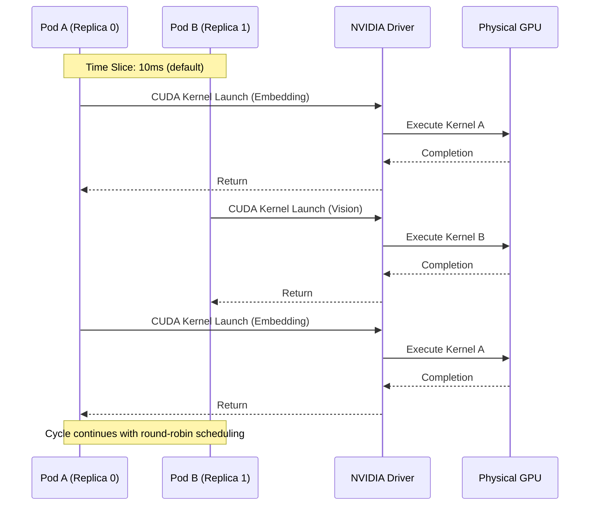
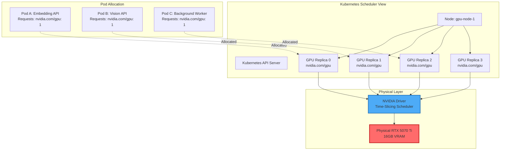
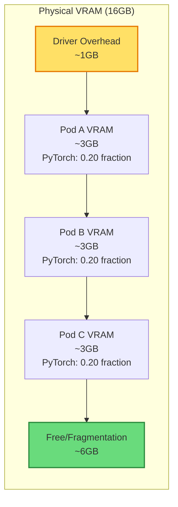

# Architecture: Bare-Metal GPU Multi-Tenancy via Time-Slicing

**Document Version:** 1.0  
**Author:** Principal MLOps Engineer  
**Last Updated:** 2026-07-02  

---

## Executive Summary

### The Problem: GPU Underutilization in Resource-Constrained Environments

Modern machine learning workloads face a critical resource allocation paradox: while GPU compute requirements continue to escalate, the economic reality of hardware procurement forces organizations to maximize utilization of available resources. In bare-metal deployments, particularly those leveraging consumer-grade GPUs, the traditional one-pod-per-GPU scheduling model results in severe underutilization. A single RTX 5070 Ti with 16GB VRAM may dedicate its entire compute capacity to a single inference service that utilizes only 25% of available memory, leaving 12GB VRAM idle while other workloads queue for access.

This inefficiency is exacerbated in edge computing and development environments where datacenter-grade GPUs (NVIDIA A100, H100) are cost-prohibitive. Consumer GPUs lack hardware-level virtualization features, traditionally forcing a choice between underutilization or complex manual workload management.

### The Solution: Software-Based GPU Time-Slicing

This architecture implements NVIDIA GPU Time-Slicing via the Kubernetes device plugin to multiplex a single physical GPU across multiple isolated workloads. By configuring the NVIDIA device plugin with a replication factor of 4, we present 4 logical GPU replicas to the Kubernetes scheduler, enabling concurrent execution of up to 4 pods on a single physical GPU.

The solution leverages:
- **k3s** for lightweight Kubernetes orchestration on bare metal
- **NVIDIA Time-Slicing** for temporal GPU multiplexing
- **Strict memory isolation** via Kubernetes resource limits and PyTorch memory management
- **DCGM-based observability** for per-pod GPU utilization tracking

This architecture achieves 4x workload density without requiring hardware virtualization, enabling cost-effective multi-tenant ML inference on consumer-grade hardware.

---

## Hardware & Constraints

### Consumer GPUs vs. Datacenter GPUs: Architectural Differences

| **Characteristic** | **Consumer GPU (RTX 5070 Ti)** | **Datacenter GPU (A100)** |
|-------------------|--------------------------------|---------------------------|
| **Architecture** | Ada Lovelace (consumer variant) | Ampere (datacenter variant) |
| **VRAM Configuration** | GDDR6X, 16GB | HBM2e, 40GB/80GB |
| **ECC Memory** | Not supported | Fully supported |
| **MIG Support** | **Not available** | Available (up to 7 instances) |
| **NVLink** | Limited/absent | Full NVLink support |
| **Thermal Design** | Active cooling for desktop | Passive for datacenter racks |
| **Driver Branch** | GeForce Game Ready | Datacenter Driver |
| **Virtualization** | Time-Slicing only | MIG + Time-Slicing |

### Why MIG (Multi-Instance GPU) Is Unavailable

MIG is a hardware-level virtualization feature available exclusively on NVIDIA datacenter GPUs (A100, A30, H100). MIG partitions a physical GPU into isolated instances with dedicated compute, memory, and cache resources at the silicon level. Each MIG instance appears as a distinct GPU device to the operating system, providing true spatial isolation.

The RTX 5070 Ti, being a consumer-grade GPU, lacks the physical circuitry required for MIG. The GeForce driver branch explicitly disables MIG functionality, and the GPU architecture does not include the memory controllers and SM (Streaming Multiprocessor) partitioning logic that MIG requires.

### Why Time-Slicing Is the Only Viable Approach

Given the hardware constraints, Time-Slicing is the sole mechanism for GPU sharing on consumer GPUs. Time-Slicing operates at the software level:

1. **Temporal Multiplexing:** The NVIDIA driver schedules GPU compute contexts in time slices, rapidly switching between workloads
2. **No Hardware Partitioning:** Unlike MIG, all workloads share the same physical memory and compute units
3. **Driver-Level Enforcement:** The CUDA driver enforces fairness and prevents starvation through round-robin scheduling

Time-Slicing provides logical isolation but requires careful memory management, as all workloads share the same VRAM space. This architecture implements strict memory limits and PyTorch memory constraints to prevent cross-workload memory interference.

---

## Methodology - Orchestration

### Why k3s Over Full Kubernetes or minikube

#### k3s vs. Full Kubernetes (kubeadm/managed)

| **Criterion** | **k3s** | **Full Kubernetes** |
|--------------|---------|---------------------|
| **Binary Size** | <100MB single binary | >1GB distributed components |
| **Memory Footprint** | ~512MB baseline | ~2GB baseline |
| **Startup Time** | <30 seconds | 5-10 minutes |
| **Component Complexity** | Single binary (control plane + agent) | Separate API server, scheduler, controller-manager, etcd, kubelet, kube-proxy |
| **Database Backend** | SQLite (default) or MySQL/PostgreSQL | etcd (distributed KV store) |
| **Container Runtime** | containerd (embedded) | containerd or CRI-O (separate installation) |
| **CNIs Supported** | Flannel (default), Calico, Cilium | Full CNI ecosystem |
| **Suitability for Bare-Metal** | **Optimized** | Over-engineered for single-node |

**Rationale:** For a single-node bare-metal deployment, full Kubernetes introduces unnecessary complexity. The etcd cluster, separate control plane components, and distributed architecture provide no benefit on a single machine. k3s consolidates all components into a single binary with SQLite backing, reducing attack surface and operational overhead while maintaining full Kubernetes API compatibility.

#### k3s vs. minikube

| **Criterion** | **k3s** | **minikube** |
|--------------|---------|--------------|
| **Deployment Target** | Production bare-metal | Local development only |
| **Hypervisor Dependency** | None (runs directly on OS) | Requires VM (VirtualBox, KVM, Hyper-V) |
| **Performance** | Native hardware performance | Virtualization overhead |
| **Persistence** | Systemd service, auto-restart | Manual lifecycle management |
| **Networking** | Host networking, bridge modes | NAT-based networking |
| **Production Readiness** | **Designed for production** | Explicitly for development |

**Rationale:** minikube is explicitly designed for local development with VM-based isolation, introducing virtualization overhead that degrades GPU performance. k3s runs directly on the host OS with systemd integration, making it suitable for production bare-metal deployments. The absence of a hypervisor layer ensures direct GPU access without passthrough complexity.

### k3s Architecture for This Project

```
┌─────────────────────────────────────────────────────────────┐
│                     Host OS (Ubuntu 24.04)                  │
│  ┌───────────────────────────────────────────────────────┐  │
│  │              k3s Binary (Single Process)              │  │
│  │  ┌───────────┐  ┌───────────┐  ┌───────────────────┐  │  │
│  │  │ API Server│  │ Scheduler │  │ Controller Manager│  │  │
│  │  └───────────┘  └───────────┘  └───────────────────┘  │  │
│  │  ┌───────────────────────────────────────────────────┐  │  │
│  │  │              containerd (Embedded)                │  │  │
│  │  │  ┌─────────────┐  ┌─────────────┐  ┌───────────┐  │  │
│  │  │  │  Pod A      │  │  Pod B      │  │  Pod C    │  │  │
│  │  │  │ (Embedding) │  │ (Vision)    │  │ (Worker)  │  │  │
│  │  │  └─────────────┘  └─────────────┘  └───────────┘  │  │
│  │  └───────────────────────────────────────────────────┘  │  │
│  │  ┌───────────────────────────────────────────────────┐  │  │
│  │  │              SQLite (Backend)                      │  │  │
│  │  └───────────────────────────────────────────────────┘  │  │
│  └───────────────────────────────────────────────────────┘  │
│  ┌───────────────────────────────────────────────────────┐  │
│  │           NVIDIA Driver + Container Toolkit           │  │
│  └───────────────────────────────────────────────────────┘  │
│  ┌───────────────────────────────────────────────────────┐  │
│  │              Physical RTX 5070 Ti (16GB)              │  │
│  └───────────────────────────────────────────────────────┘  │
└─────────────────────────────────────────────────────────────┘
```

### k3s Installation Strategy

The installation uses the official k3s installation script with specific flags for GPU support:

```bash
curl -sfL https://get.k3s.io | sh -s - \
  --docker \                    # Use Docker runtime instead of containerd
  --disable traefik \           # Disable default ingress (we use Nginx)
  --disable servicelb \         # Disable default LB (we use Nginx ingress)
  --node-name gpu-node-1 \      # Explicit node naming
  --write-kubeconfig-mode 644   # Allow non-root kubeconfig access
```

The `--docker` flag is critical because the NVIDIA Container Toolkit has first-class Docker integration, simplifying GPU passthrough configuration compared to containerd's nvidia-container-runtime configuration.

---

## Methodology - Time-Slicing Deep Dive

### NVIDIA Device Plugin Architecture

The NVIDIA Kubernetes device plugin acts as a gRPC server that:
1. **Discovers** GPU devices on the node via NVML (NVIDIA Management Library)
2. **Advertises** GPU resources to the Kubernetes API server via the Device Plugin protocol
3. **Allocates** GPU devices to pods during scheduling
4. **Mounts** GPU devices and driver libraries into pod containers

In standard operation, the device plugin advertises one `nvidia.com/gpu` resource per physical GPU. With Time-Slicing enabled, the plugin intercepts this advertisement and presents multiple logical replicas.

### Time-Slicing ConfigurationMap Mechanics

The Time-Slicing configuration is applied via a ConfigMap that the device plugin watches:

```yaml
apiVersion: v1
kind: ConfigMap
metadata:
  name: nvidia-device-plugin-config
  namespace: kube-system
data:
  config.yaml: |
    version: v1
    sharing:
      timeSlicing:
        renameByDefault: false
        failRequestsGreaterThanOne: true
        maxShares: 4
        resources:
          - name: nvidia.com/gpu
            replicas: 4
```

**Configuration Parameters:**
- `replicas: 4`: Splits each physical GPU into 4 logical replicas
- `failRequestsGreaterThanOne: true`: Rejects pod requests for >1 GPU (enforces 1:1 mapping)
- `renameByDefault: false`: Keeps the resource name as `nvidia.com/gpu` (not renamed to `nvidia.com/gpu.share`)
- `maxShares: 4`: Upper bound on replication factor

### Device Plugin Advertisement Interception

When the device plugin loads this configuration, it modifies the resource advertisement flow:

```
┌─────────────────────────────────────────────────────────────────┐
│                    Standard Flow (No Time-Slicing)              │
├─────────────────────────────────────────────────────────────────┤
│ Physical GPU Discovery → Advertise 1× nvidia.com/gpu            │
│ Kubernetes Scheduler → Pod requests nvidia.com/gpu: 1          │
│ Device Plugin → Allocates physical GPU 0 to pod                │
└─────────────────────────────────────────────────────────────────┘

┌─────────────────────────────────────────────────────────────────┐
│                 Time-Slicing Flow (With Config)                │
├─────────────────────────────────────────────────────────────────┤
│ Physical GPU Discovery → Config Applied → Advertise 4× nvidia.com/gpu │
│ Kubernetes Scheduler → Sees 4 GPU replicas on node             │
│ Pod A requests nvidia.com/gpu: 1 → Allocated replica 0          │
│ Pod B requests nvidia.com/gpu: 1 → Allocated replica 1          │
│ Pod C requests nvidia.com/gpu: 1 → Allocated replica 2          │
│ Pod D requests nvidia.com/gpu: 1 → Allocated replica 3          │
│ All pods map to same physical GPU 0 via time-slice scheduling   │
└─────────────────────────────────────────────────────────────────┘
```

### CUDA Context Switching Under the Hood

When multiple pods execute GPU work concurrently, the NVIDIA driver employs time-sliced context switching:



**Technical Details:**
1. **Context Switching Overhead:** The driver maintains separate CUDA contexts for each process. Context switching involves saving/restoring GPU register state, which adds ~10-50μs overhead per switch
2. **Time Slice Duration:** Default is 10ms, configurable via the `CUDA_MPS_PIPE_DIRECTORY` environment variable for MPS (Multi-Process Service) scenarios
3. **Warp Scheduling:** Within a time slice, the GPU's warp scheduler executes warps from the active context. Warps from different contexts never execute simultaneously
4. **Memory Coherency:** All contexts share the same VRAM space. The driver ensures memory isolation through virtual address mapping, but physical memory is shared

### Time-Slicing vs. MPS (Multi-Process Service)

While both enable GPU sharing, Time-Slicing and MPS differ fundamentally:

| **Aspect** | **Time-Slicing** | **MPS** |
|------------|------------------|---------|
| **Scheduling Granularity** | Kernel-level (time-sliced) | Thread-level (interleaved) |
| **Context Isolation** | Separate CUDA contexts | Single context, multiple client queues |
| **Memory Overhead** | Higher (per-context metadata) | Lower (shared context) |
| **Setup Complexity** | Low (device plugin config) | High (MPS daemon management) |
| **Suitability for Inference** | **Preferred** (predictable latency) | Better for training (higher throughput) |

This architecture uses Time-Slicing because it provides predictable latency bounds for inference workloads, whereas MPS optimizes for throughput at the cost of latency variance.

---

## Methodology - Workload Isolation

### The OOM Problem in Time-Sliced Environments

In Time-Sliced configurations, all pods share the same physical VRAM. Without strict memory management, a single pod can:
1. **Allocate excessive VRAM** during model loading, starving other pods
2. **Cause CUDA OOM errors** when the driver cannot satisfy allocation requests
3. **Trigger pod eviction** via the Kubernetes OOMKiller when system RAM is exhausted

The RTX 5070 Ti has 16GB VRAM. With 4 replicas, each pod should target ≤4GB VRAM usage to maintain headroom for fragmentation and driver overhead.

### Kubernetes Resource Limits Strategy

Each deployment enforces strict resource constraints:

```yaml
resources:
  requests:
    memory: "2Gi"
    nvidia.com/gpu: 1
  limits:
    memory: "4Gi"
    nvidia.com/gpu: 1
```

**Rationale:**
- **Memory Request (2Gi):** Guarantees the pod has 2GB system RAM for CPU-side operations (preprocessing, HTTP handling)
- **Memory Limit (4Gi):** Hard cap on system RAM. Exceeding this triggers OOMKiller, preventing the pod from consuming all host memory
- **GPU Request/Limit (1):** Requests 1 logical GPU replica. The limit matches the request (no GPU overcommit)

**Critical Note:** Kubernetes `limits.memory` controls **system RAM**, not VRAM. VRAM limits are enforced at the application level via PyTorch configuration.

### PyTorch Memory Configuration

Each FastAPI service configures PyTorch to respect VRAM constraints:

```python
import torch

# Set memory fraction to limit VRAM usage
torch.cuda.set_per_process_memory_fraction(0.20, device=0)  # 20% of 16GB = ~3.2GB

# Enable memory-efficient attention (if using transformers)
torch.backends.cuda.matmul.allow_tf32 = True
torch.backends.cudnn.allow_tf32 = True

# Pre-allocate memory on startup to avoid allocation spikes during inference
model = model.to('cuda')
_ = model(torch.randn(1, 3, 224, 224).to('cuda'))  # Warmup forward pass
```

**Configuration Parameters:**
- `set_per_process_memory_fraction(0.20)`: Limits PyTorch to 20% of total VRAM (~3.2GB on 16GB GPU)
- `allow_tf32`: Enables TF32 tensor cores for faster computation with minimal precision loss
- **Warmup Forward Pass:** Allocates all required memory on startup, preventing allocation delays during inference

### FastAPI Memory Management

FastAPI itself is memory-light, but we implement safeguards:

```python
from fastapi import FastAPI, UploadFile
from fastapi.concurrency import run_in_threadpool

app = FastAPI()

# Limit request body size to prevent memory bombs
@app.middleware("http")
async def limit_body_size(request: Request, call_next):
    content_length = request.headers.get("content-length")
    if content_length and int(content_length) > 10 * 1024 * 1024:  # 10MB limit
        raise HTTPException(status_code=413, detail="Payload too large")
    return await call_next(request)

# Process large files in chunks to avoid loading entire file into memory
@app.post("/classify")
async def classify(file: UploadFile):
    async with run_in_threadpool(lambda: process_image_chunked(file)):
        return {"result": "processed"}
```

### Memory Allocation Strategy by Workload

| **Workload** | **Model Size** | **Target VRAM** | **System RAM** | **PyTorch Fraction** |
|--------------|----------------|-----------------|----------------|---------------------|
| Embedding API | ~400MB (all-MiniLM-L6-v2) | 3GB | 2GB | 0.20 |
| Vision API | ~500MB (ResNet-18) | 3GB | 2GB | 0.20 |
| Background Worker | ~600MB (custom model) | 3GB | 2GB | 0.20 |

**Total VRAM Budget:** 9GB allocated, 7GB headroom for fragmentation, driver overhead, and transient allocations.

### OOM Prevention Monitoring

The architecture includes proactive monitoring:
1. **DCGM Exporter:** Tracks `DCGM_FI_DEV_FB_USED` (frame buffer usage) per pod
2. **Grafana Alerts:** Trigger when per-pod VRAM exceeds 3.5GB
3. **Kubernetes Events:** Monitor OOMKilled events via Prometheus

---

## Methodology - Observability

### Why DCGM (Data Center GPU Manager)

DCGM is NVIDIA's telemetry library for GPU monitoring. Unlike `nvidia-smi` (which provides point-in-time snapshots), DCGM offers:
- **High-frequency metrics collection** (1-second intervals by default)
- **Per-process GPU utilization** (critical for Time-Sliced environments)
- **Comprehensive metric coverage** (temperature, power, memory, clock speeds, ECC errors)
- **Prometheus-native export** via the DCGM Exporter container

### DCGM Exporter Architecture

The DCGM Exporter runs as a DaemonSet, ensuring one instance per node:

```yaml
apiVersion: apps/v1
kind: DaemonSet
metadata:
  name: dcgm-exporter
  namespace: monitoring
spec:
  selector:
    matchLabels:
      app: dcgm-exporter
  template:
    spec:
      containers:
      - name: dcgm-exporter
        image: nvidia/dcgm-exporter:3.3.0-3.1.0-ubuntu22.04
        securityContext:
          capabilities:
            add: ["SYS_ADMIN"]
        volumeMounts:
        - name: gpu-device
          mountPath: /dev/nvidia0
        ports:
        - containerPort: 9400
      volumes:
      - name: gpu-device
        hostPath:
          path: /dev/nvidia0
```

**Critical Configuration:**
- **SYS_ADMIN capability:** Required for DCGM to access GPU performance counters
- **Device mount:** Direct `/dev/nvidia0` access for hardware-level metrics
- **Port 9400:** Default Prometheus exposition format endpoint

### Critical Metric: DCGM_FI_DEV_FB_USED

`DCGM_FI_DEV_FB_USED` (Field ID 158) measures the GPU frame buffer (VRAM) usage in bytes. This metric is critical for Time-Sliced architectures because:

1. **Per-Pod Attribution:** DCGM can attribute VRAM usage to specific processes (pods), enabling granular monitoring
2. **Fragmentation Detection:** Sudden increases in FB_USED without corresponding workload increases indicate memory fragmentation
3. **Capacity Planning:** Historical FB_USED data informs optimal replica counts and memory fraction settings
4. **Leak Detection:** Monotonically increasing FB_USED indicates memory leaks in PyTorch applications

**Metric Collection Configuration:**

```yaml
# dcgm-exporter-helm-values.yaml
dcgmExporter:
  enabled: true
  serviceMonitor:
    enabled: true
  extraArgs:
    - --families=DCGM_FI_DEV_FB_USED,DCGM_FI_DEV_GPU_UTIL,DCGM_FI_DEV_POWER_USAGE
```

### Prometheus Scraping Configuration

Prometheus scrapes DCGM metrics via the ServiceMonitor:

```yaml
apiVersion: monitoring.coreos.com/v1
kind: ServiceMonitor
metadata:
  name: dcgm-exporter
  namespace: monitoring
spec:
  selector:
    matchLabels:
      app: dcgm-exporter
  endpoints:
  - port: metrics
    interval: 15s
    path: /metrics
```

**Scrape Interval:** 15 seconds balances granularity with scrape overhead. For production, consider 5s intervals during load testing.

### Grafana Dashboard Configuration

Key panels for Time-Sliced monitoring:

1. **Per-Pod VRAM Usage:** `DCGM_FI_DEV_FB_USED{pod_name="embedding-service"}` / 1024^3 (convert to GB)
2. **GPU Utilization by Replica:** `DCGM_FI_DEV_GPU_UTIL{gpu_id="0", replica_id="0"}`
3. **Time-Slice Efficiency:** Ratio of active compute time to total time (derived from utilization)
4. **Memory Fragmentation Index:** `(DCGM_FI_DEV_FB_ALLOCATED - DCGM_FI_DEV_FB_USED) / DCGM_FI_DEV_FB_ALLOCATED`

### Alerting Rules

```yaml
groups:
- name: gpu-time-slicing
  rules:
  - alert: PodVRAMExceededThreshold
    expr: DCGM_FI_DEV_FB_USED{pod_name=~".*"} > 3.5 * 1024^3
    for: 5m
    annotations:
      summary: "Pod {{ $labels.pod_name }} VRAM exceeds 3.5GB"
  
  - alert: GPUUtilizationSaturation
    expr: avg(DCGM_FI_DEV_GPU_UTIL) > 95
    for: 10m
    annotations:
      summary: "GPU {{ $labels.gpu_id }} utilization > 95%, consider reducing replica count"
```

---

## Time-Slicing Visualization

### Logical to Physical GPU Mapping



### Time-Sliced Execution Timeline

```mermaid
gantt
    title GPU Time-Slicing Execution (10ms slices)
    dateFormat X
    axisFormat %Lms
    
    section Pod A (Embedding)
    Kernel Execution A1    :active, 0, 10
    Idle                    :10, 10
    Kernel Execution A2    :active, 20, 10
    Idle                    :30, 10
    
    section Pod B (Vision)
    Idle                    :0, 10
    Kernel Execution B1    :active, 10, 10
    Idle                    :20, 10
    Kernel Execution B2    :active, 30, 10
    
    section Pod C (Worker)
    Idle                    :0, 20
    Kernel Execution C1    :active, 20, 10
    Idle                    :30, 10
```



### Memory Allocation Layout



---

## Conclusion

This architecture demonstrates a production-ready approach to GPU multi-tenancy on consumer-grade hardware using software-based Time-Slicing. By combining k3s for lightweight orchestration, strict memory isolation via Kubernetes limits and PyTorch configuration, and comprehensive observability via DCGM, we achieve 4x workload density without requiring datacenter-grade hardware.

The key technical innovations include:
1. **Device plugin interception** to present logical GPU replicas to the scheduler
2. **Per-process memory fractioning** to prevent VRAM exhaustion in shared environments
3. **DCGM-based per-pod attribution** for granular utilization monitoring

This architecture is directly applicable to edge computing scenarios, development environments, and cost-constrained production deployments where datacenter GPUs are economically infeasible.
