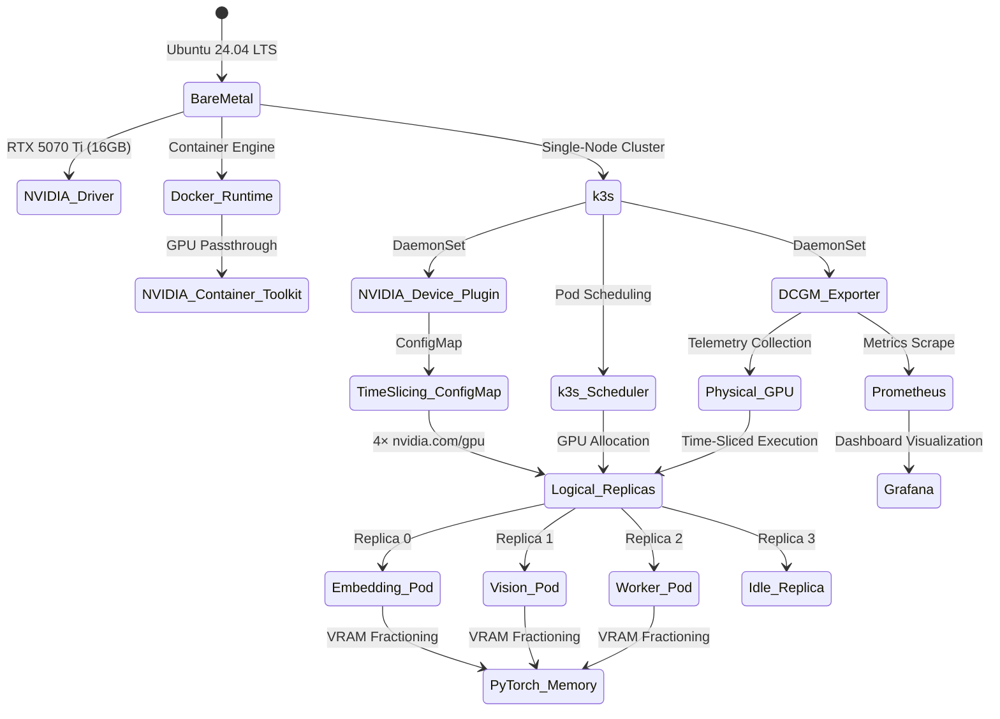
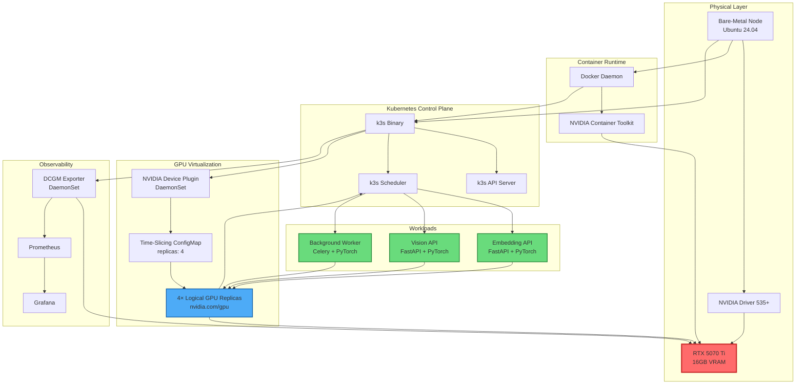

# Documentation Index: Bare-Metal GPU Multi-Tenancy Cluster

**Project:** GPU Orchestration via Time-Slicing on Consumer Hardware  
**Architecture:** k3s + NVIDIA Time-Slicing + PyTorch Workloads + DCGM Observability  
**Last Updated:** 2026-07-02  

---

## Documentation Relationship Matrix

| **Component** | **Associated Doc** | **Depends On** | **Purpose** |
|---------------|-------------------|----------------|-------------|
| **Bare-Metal Node** | `01-infrastructure-setup.md` | None | Ubuntu 24.04 base OS, NVIDIA drivers, Docker runtime |
| **k3s Control Plane** | `01-infrastructure-setup.md` | Bare-Metal Node | Lightweight Kubernetes distribution for single-node deployment |
| **NVIDIA Container Toolkit** | `01-infrastructure-setup.md` | Bare-Metal Node, Docker | Enables GPU passthrough to containers |
| **NVIDIA Device Plugin** | `02-gpu-time-slicing-config.md` | k3s, Container Toolkit | Advertises GPU resources to Kubernetes scheduler |
| **Time-Slicing ConfigMap** | `02-gpu-time-slicing-config.md` | Device Plugin | Splits 1 physical GPU into 4 logical replicas |
| **FastAPI Embedding Service** | `03-workloads-and-memory.md` | Time-Slicing Config | Text embedding inference API |
| **FastAPI Vision Service** | `03-workloads-and-memory.md` | Time-Slicing Config | Image classification inference API |
| **Celery Background Worker** | `03-workloads-and-memory.md` | Time-Slicing Config | Asynchronous ML task processing |
| **PyTorch Memory Management** | `03-workloads-and-memory.md` | All Workloads | VRAM fractioning to prevent OOM |
| **DCGM Exporter** | `04-observability-dcgm.md` | k3s Container Runtime | GPU telemetry collection for Prometheus |
| **Prometheus** | `04-observability-dcgm.md` | k3s, DCGM Exporter | Metrics storage and querying |
| **Grafana** | `04-observability-dcgm.md` | Prometheus | Visualization dashboard for GPU metrics |
| **GitHub Actions CI** | `05-gitops-cicd.md` | Workloads, Container Registry | Automated container image builds and security scanning |
| **ArgoCD** | `05-gitops-cicd.md` | k3s, GitHub Actions | GitOps-based deployment and self-healing |
| **FinOps Analysis** | `06-finops-roi-analysis.md` | All Components | Cost-benefit analysis and ROI calculations |
| **Locust Load Testing** | `07-performance-benchmarks.md` | Workloads | Performance benchmarking and capacity planning |
| **Power Management** | `08-hardware-power-optimization.md` | GPU, DCGM | GreenOps power capping and thermal optimization |
| **NetworkPolicy** | `09-security-and-network-isolation.md` | k3s, Workloads | Zero-trust network isolation and RBAC |
| **Velero** | `10-disaster-recovery.md` | k3s, MinIO | Automated backup and restore operations |
| **MinIO** | `10-disaster-recovery.md` | k3s | S3-compatible storage for backup repository |

---

## Architecture Overview Diagram

---

## Component Interaction Flowchart

---

## Reading Guide

### For New Engineers (First-Time Setup)

**Start Here:** `01-infrastructure-setup.md`

This document provides the foundational steps for preparing the bare-metal node. Without completing these steps, no other components can function. The guide covers:
- Ubuntu 24.04 system preparation
- k3s installation with Docker runtime
- NVIDIA Container Toolkit configuration
- GPU driver verification

**Next:** `02-gpu-time-slicing-config.md`

Once infrastructure is ready, configure GPU virtualization. This document explains:
- NVIDIA Device Plugin deployment via Helm
- Time-Slicing ConfigMap creation
- Verification that the scheduler sees 4 GPU replicas

**Then:** `03-workloads-and-memory.md`

With GPU virtualization active, deploy your ML workloads. This document covers:
- Kubernetes Deployment templates with GPU requests
- PyTorch memory fractioning to prevent OOM
- FastAPI service configuration

**Finally:** `04-observability-dcgm.md`

Complete the core stack with monitoring. This document details:
- DCGM Exporter deployment
- Prometheus and Grafana setup via Helm
- Critical PromQL queries for GPU monitoring

### For Advanced Operations (Production Readiness)

**GitOps and CI/CD:** `05-gitops-cicd.md`

Automate your deployment pipeline with:
- GitHub Actions for container builds and security scanning
- ArgoCD for GitOps-based k3s deployments
- Image updater and notification setup

**Financial Analysis:** `06-finops-roi-analysis.md`

Evaluate the economic impact with:
- Cloud vs. bare-metal cost comparison
- ROI calculations for Time-Slicing architecture
- Carbon footprint and sustainability metrics

**Performance Testing:** `07-performance-benchmarks.md`

Validate system capacity with:
- Locust load testing for embedding and vision APIs
- Performance metrics and success criteria
- Capacity planning recommendations

**Power Optimization:** `08-hardware-power-optimization.md`

Implement GreenOps practices with:
- NVIDIA power capping for RTX 5070 Ti
- Thermal target configuration
- Energy savings calculations

**Security Hardening:** `09-security-and-network-isolation.md`

Secure your cluster with:
- Kubernetes NetworkPolicy for zero-trust isolation
- RBAC and pod security standards
- Namespace-level security policies

**Disaster Recovery:** `10-disaster-recovery.md`

Ensure business continuity with:
- Velero automated backups to MinIO
- RTO/RPO objectives and testing procedures
- Complete cluster recovery runbook

### For Troubleshooting

- **GPU not visible in pods:** Check `01-infrastructure-setup.md` (Container Toolkit) and `02-gpu-time-slicing-config.md` (Device Plugin)
- **Pods in OOMKilled state:** Review `03-workloads-and-memory.md` (memory limits and PyTorch configuration)
- **No metrics in Grafana:** Verify `04-observability-dcgm.md` (DCGM Exporter and Prometheus scraping)
- **Scheduler rejects GPU requests:** Ensure `02-gpu-time-slicing-config.md` (ConfigMap applied correctly)
- **ArgoCD sync failures:** Review `05-gitops-cicd.md` (Git repository access and credentials)
- **Backup failures:** Check `10-disaster-recovery.md` (MinIO connectivity and Velero configuration)
- **Network policy blocking traffic:** Verify `09-security-and-network-isolation.md` (NetworkPolicy rules and egress allowances)

### For Architecture Review

- **High-level design:** Review the relationship matrix and diagrams in this document
- **Deep technical details:** Refer to [ARCHITECTURE.md](../ARCHITECTURE.md) for comprehensive methodology explanations
- **Implementation specifics:** Each component document provides exact YAML, bash commands, and code snippets

---

## Quick Reference: Verification Commands

| **Component** | **Verification Command** | **Expected Output** |
|--------------|-------------------------|-------------------|
| **k3s Status** | `sudo systemctl status k3s` | Active: active (running) |
| **GPU Visibility** | `nvidia-smi` | RTX 5070 Ti listed with 16GB VRAM |
| **Docker GPU Support** | `docker run --rm --gpus all nvidia/cuda:12.1.0-base-ubuntu22.04 nvidia-smi` | Same as host nvidia-smi output |
| **Device Plugin Running** | `kubectl get pods -n kube-system -l name=nvidia-device-plugin-ds` | 1/1 Running |
| **GPU Replicas Available** | `kubectl describe node gpu-node-1 | grep nvidia.com/gpu` | nvidia.com/gpu: 4 |
| **DCGM Exporter Metrics** | `curl http://localhost:9400/metrics | grep DCGM_FI_DEV_FB_USED` | Metric values present |
| **Prometheus Targets** | `kubectl get prometheus -n monitoring` | Available in monitoring namespace |

---

## Document Version History

| **Version** | **Date** | **Changes** |
|-------------|----------|-------------|
| 1.0 | 2026-07-02 | Initial documentation structure created |

---

## Contributing

When modifying this documentation:
1. Update the relationship matrix if component dependencies change
2. Regenerate Mermaid diagrams if architecture evolves
3. Update verification commands if tooling versions change
4. Increment the version history with each significant update
