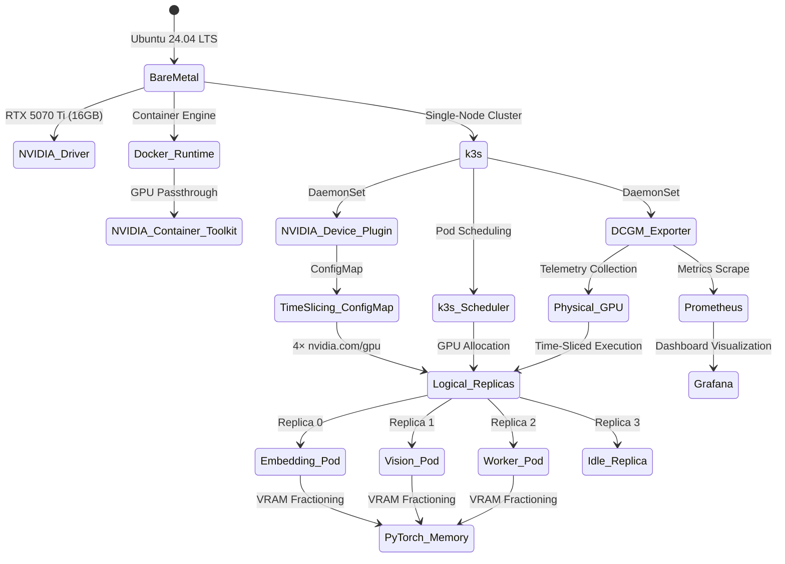
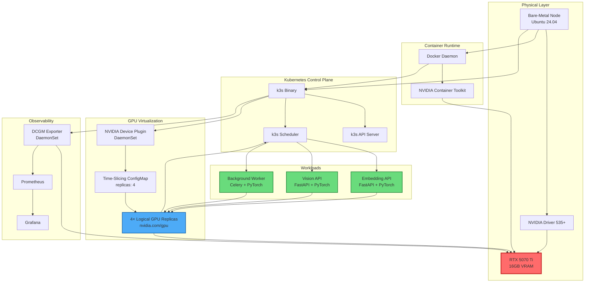

# Documentation Index: Bare-Metal GPU Multi-Tenancy Cluster

**Project:** GPU Orchestration via Time-Slicing on Consumer Hardware  
**Architecture:** k3s + NVIDIA Time-Slicing + PyTorch Workloads + DCGM Observability  
**Last Updated:** 2026-07-02  

---

## Documentation Relationship Matrix

| **Component** | **Associated Doc** | **Depends On** | **Purpose** |
|---------------|-------------------|----------------|-------------|
| **Bare-Metal Node** | `01-infrastructure-setup.md` | None | Ubuntu 24.04 base OS, NVIDIA drivers, Docker runtime |
| **k3s Control Plane** | `01-infrastructure-setup.md` | Bare-Metal Node | Lightweight Kubernetes distribution for single-node deployment |
| **NVIDIA Container Toolkit** | `01-infrastructure-setup.md` | Bare-Metal Node, Docker | Enables GPU passthrough to containers |
| **NVIDIA Device Plugin** | `02-gpu-time-slicing-config.md` | k3s, Container Toolkit | Advertises GPU resources to Kubernetes scheduler |
| **Time-Slicing ConfigMap** | `02-gpu-time-slicing-config.md` | Device Plugin | Splits 1 physical GPU into 4 logical replicas |
| **FastAPI Embedding Service** | `03-workloads-and-memory.md` | Time-Slicing Config | Text embedding inference API |
| **FastAPI Vision Service** | `03-workloads-and-memory.md` | Time-Slicing Config | Image classification inference API |
| **Celery Background Worker** | `03-workloads-and-memory.md` | Time-Slicing Config | Asynchronous ML task processing |
| **PyTorch Memory Management** | `03-workloads-and-memory.md` | All Workloads | VRAM fractioning to prevent OOM |
| **DCGM Exporter** | `04-observability-dcgm.md` | k3s Container Runtime | GPU telemetry collection for Prometheus |
| **Prometheus** | `04-observability-dcgm.md` | k3s, DCGM Exporter | Metrics storage and querying |
| **Grafana** | `04-observability-dcgm.md` | Prometheus | Visualization dashboard for GPU metrics |
| **GitHub Actions CI** | `05-gitops-cicd.md` | Workloads, Container Registry | Automated container image builds and security scanning |
| **ArgoCD** | `05-gitops-cicd.md` | k3s, GitHub Actions | GitOps-based deployment and self-healing |
| **KEDA Autoscaler** | `20-keda-autoscaling.md` | Redis, Workloads | Event-driven autoscaling for background tasks |
| **KubeRay** | `21-ray-distributed-ml.md` | k3s | Distributed ML task processing |
| **OpenTelemetry/Jaeger** | `17-opentelemetry-tracing.md` | Workloads | Distributed request tracing |
| **MLflow Registry** | `18-mlflow-registry.md` | k3s | Model registry and LoRA adapter management |
| **FinOps Analysis** | `06-finops-roi-analysis.md` | All Components | Cost-benefit analysis and ROI calculations |
| **Locust Load Testing** | `07-performance-benchmarks.md` | Workloads | Performance benchmarking and capacity planning |
| **Power Management** | `08-hardware-power-optimization.md` | GPU, DCGM | Power capping and thermal optimization |
| **NetworkPolicy** | `09-security-and-network-isolation.md` | k3s, Workloads | Network isolation and RBAC |
| **Velero** | `10-disaster-recovery.md` | k3s, MinIO | Automated backup and restore operations |
| **MinIO** | `10-disaster-recovery.md` | k3s | S3-compatible storage for backup repository |

---

## Architecture Overview Diagram

---

## Component Interaction Flowchart

---

## Reading Guide

### Core Implementation
These documents must be executed sequentially to establish the base infrastructure.

* `01-infrastructure-setup.md`
  - Ubuntu 24.04 system preparation.
  - k3s installation with Docker runtime.
  - NVIDIA Container Toolkit configuration.
  - GPU driver verification.
* `02-gpu-time-slicing-config.md`
  - NVIDIA Device Plugin deployment via Helm.
  - Time-Slicing ConfigMap creation.
  - Scheduler verification for 4 GPU replicas.
* `03-workloads-and-memory.md`
  - Kubernetes Deployment templates with GPU requests.
  - PyTorch memory fractioning to prevent OOM.
  - FastAPI service configuration.
* `04-observability-dcgm.md`
  - DCGM Exporter deployment.
  - Prometheus and Grafana setup via Helm.
  - PromQL queries for GPU monitoring.

### Advanced Operations
Once the core infrastructure is running, these modules provide operational and security enhancements.

* `05-gitops-cicd.md`
  - GitHub Actions for container builds.
  - ArgoCD for GitOps-based deployments.
* `06-finops-roi-analysis.md`
  - Cost comparison models.
  - Capacity planning calculations.
* `07-performance-benchmarks.md`
  - Locust load testing methodologies.
* `08-hardware-power-optimization.md`
  - NVIDIA power capping configurations.
  - Thermal target management.
* `09-security-and-network-isolation.md`
  - Kubernetes NetworkPolicy.
  - RBAC and pod security standards.
* `10-disaster-recovery.md`
  - Velero automated backups to MinIO.
  - RTO/RPO objectives and recovery runbooks.
* `11-remote-server-deployment.md`
  - Server hardening and UFW rules.
  - Ingress with cert-manager Let's Encrypt TLS.
* `12-model-caching-pvc.md`
  - HostPath Persistent Volumes for shared Hugging Face caches.
* `13-api-gateway-rate-limiting.md`
  - NGINX Ingress controller annotations for traffic control.
* `14-multi-gpu-advanced-topology.md`
  - Scaling architectures across multiple physical GPUs.

### Advanced MLOps Integration
Extensions for complex machine learning pipelines.

* `15-dynamic-batching-vllm.md`
  - vLLM and PagedAttention configuration.
* `61-multimodal-vision-models.md`
  - Triton & vLLM serving for heavy LLaVA/CLIP image tensors.
* `16-multi-lora-architecture.md`
  - Dynamic LoRA adapter routing on a single base model.
* `17-opentelemetry-tracing.md`
  - Distributed request tracing via Jaeger.
* `18-mlflow-registry.md`
  - Model and artifact versioning.
* `19-concurrency-limits.md`
  - FastAPI `asyncio.Semaphore` implementation.
* `20-keda-autoscaling.md`
  - Redis queue-based worker autoscaling.
* `21-ray-distributed-ml.md`
  - KubeRay distributed processing clusters.

### System Administration & Advanced Optimization
* `22-node-resource-reservation.md`
  - Kubelet resource allocations for OS stability.
* `23-model-quantization-strategies.md`
  - AWQ and GPTQ 4-bit compression for VRAM boundaries.
* `24-log-aggregation-loki.md`
  - Centralized PLG stack for unified container logging.
* `25-storage-io-optimization.md`
  - NVMe RAID 0 and XFS tuning for rapid model loads.
* `26-gpu-node-maintenance.md`
  - Zero-downtime cordon and drain procedures for kernel patches.
* `27-distributed-storage-ceph.md`
  - CephFS architecture for multi-node model caching.
* `28-service-mesh-istio.md`
  - Istio Sidecars, mTLS, and advanced circuit breaking.
* `29-nccl-rdma-networking.md`
  - GPU-Direct RDMA over Converged Ethernet (RoCEv2) for NCCL.
* `30-continuous-profiling-pyroscope.md`
  - Identifying Python GIL contention via Grafana Pyroscope.
* `31-mig-vs-time-slicing.md`
  - Hardware vs Software GPU multiplexing topology selection.
* `32-spot-instance-preemption.md`
  - Workload survivability under sudden instance termination.

### Hyper-Scale Enterprise Topologies
* `33-triton-inference-server.md`
  - NVIDIA Triton & TensorRT for extreme Vision/Audio throughput.
* `34-rag-vector-database.md`
  - Qdrant/Milvus deployment for scalable RAG pipelines.
* `35-secrets-management-vault.md`
  - HashiCorp Vault & External Secrets Operator (ESO) integration.
* `36-air-gapped-deployments.md`
  - Offline AI deployments with Harbor and HuggingFace caching.
* `37-ha-control-plane.md`
  - High Availability k3s Masters with external PostgreSQL.
* `38-finops-kubecost-chargeback.md`
  - GPU cost attribution and internal chargeback via Kubecost.
* `39-multi-cluster-federation.md`
  - Geographically distributed ML via Karmada Federation.
* `40-automated-model-evaluation.md`
  - LLM-as-a-Judge and Ragas continuous evaluation pipelines.
* `41-feature-store-feast.md`
  - Feast Feature Store for caching real-time ML features.
* `42-model-drift-evidently.md`
  - Data Drift detection using Evidently AI.
* `43-confidential-computing-tee.md`
  - Trusted Execution Environments (TEE) for model weight protection.
* `44-slsa-supply-chain-security.md`
  - SLSA Level 3 image signing and Kyverno validation.
* `45-energy-attribution-kepler.md`
  - Granular Watt-Hour tracking per Pod via Kepler eBPF.
* `46-data-version-control-dvc.md`
  - DVC tracking for terabyte-scale MinIO datasets.
* `47-hyperparameter-tuning.md`
  - Distributed HPO with Ray Tune and Optuna.
* `48-canary-deployments-ab-testing.md`
  - Istio VirtualServices for Canary and Dark Launch testing.
* `49-gpu-direct-storage.md`
  - Bypassing CPU for direct NVMe to VRAM model loading.
* `50-continuous-ml-cml.md`
  - CI/CD automation for model accuracy in PR comments.

### Platform Engineering & Advanced DX
* `51-bare-metal-load-balancing.md`
  - Highly Available external routing with MetalLB (L2/BGP).
* `52-llm-guardrails.md`
  - Real-time semantic validation against prompt injections.
* `53-k8s-runtime-security-falco.md`
  - eBPF runtime syscall monitoring and threat detection.
* `54-ml-pipeline-orchestration.md`
  - DAG-based end-to-end MLOps using Argo Workflows.
* `55-scale-to-zero-knative.md`
  - Serverless HTTP endpoints to reclaim idle GPU memory.
* `56-jupyterhub-ml-workspaces.md`
  - Interactive multi-user Data Science environments.

### AI Application Layer
* `57-ai-api-gateway-litellm.md`
  - Routing, fallback, and cost tracking with LiteLLM.
* `58-semantic-caching-redis.md`
  - Bypassing GPUs for duplicate queries using GPTCache.
* `59-structured-json-outputs.md`
  - Enforcing strict JSON schemas at the vLLM engine level.
* `60-stateful-ai-agents-langgraph.md`
  - Orchestrating persistent multi-agent workflows in Kubernetes.

### V2.0 Roadmap (Future Implementations)
* `62-agentic-long-term-memory.md`
  - Semantic cross-session memory via Mem0 and Qdrant.

### Troubleshooting Index

* **GPU not visible in pods:** Review `01-infrastructure-setup.md` (Container Toolkit) and `02-gpu-time-slicing-config.md` (Device Plugin).
* **Pods in OOMKilled state:** Review `03-workloads-and-memory.md` (memory limits and PyTorch constraints).
* **No metrics in Grafana:** Review `04-observability-dcgm.md` (DCGM Exporter logs and Prometheus ServiceMonitors).
* **Scheduler rejects GPU requests:** Review `02-gpu-time-slicing-config.md` (ConfigMap and Device Plugin daemonset).
* **ArgoCD sync failures:** Review `05-gitops-cicd.md` (Repository RBAC).
* **Backup failures:** Review `10-disaster-recovery.md` (MinIO connectivity).
* **Network policy drops:** Review `09-security-and-network-isolation.md` (Egress/Ingress allowances).

For architectural context, refer to the diagrams above or `ARCHITECTURE.md`.

---

## Verification Commands

| **Component** | **Verification Command** | **Expected Output** |
|--------------|-------------------------|-------------------|
| **k3s Status** | `sudo systemctl status k3s` | Active: active (running) |
| **GPU Visibility** | `nvidia-smi` | RTX 5070 Ti listed with 16GB VRAM |
| **Docker GPU Support** | `docker run --rm --gpus all nvidia/cuda:12.1.0-base-ubuntu22.04 nvidia-smi` | Output matches host nvidia-smi |
| **Device Plugin** | `kubectl get pods -n kube-system -l name=nvidia-device-plugin-ds` | 1/1 Running |
| **GPU Replicas** | `kubectl describe node <node-name> \| grep nvidia.com/gpu` | nvidia.com/gpu: 4 |
| **DCGM Exporter** | `curl http://localhost:9400/metrics \| grep DCGM_FI_DEV_FB_USED` | Telemetry values present |
| **Prometheus Targets** | `kubectl get prometheus -n monitoring` | Active |

---

## Document Version History

| **Version** | **Date** | **Changes** |
|-------------|----------|-------------|
| 1.0 | 2026-07-02 | Initial documentation baseline. |

## Maintenance

When modifying this documentation cluster:
1. Update the relationship matrix if dependencies change.
2. Regenerate Mermaid diagrams.
3. Update verification commands if tooling versions are bumped.
4. Increment the version history block.
